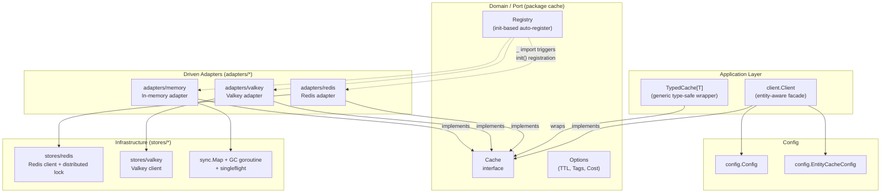

# nyro

A production-grade **Hexagonal Architecture** (Ports & Adapters) cache library for Go.

nyro provides a clean, modular abstraction over distributed and in-memory cache backends. Swap backends
or add new ones with minimal effort — only an adapter needs to be implemented and registered.

## Architecture

nyro follows the Hexagonal Architecture pattern, keeping the core domain (the `Cache` port) completely
decoupled from infrastructure concerns (adapters, stores, config).



### Key Design Principles

| Concept | Detail |
|---------|--------|
| **Port** | `cache.Cache` interface — the only contract the application knows about |
| **Adapters** | Plug-in implementations: Redis, Valkey, Memory |
| **Registry** | Auto-register via Go `init()` side-effect imports — pay only for what you import |
| **TypedCache[T]** | Generic wrapper eliminating `any`-based type assertions |
| **Singleflight** | Memory adapter deduplicates concurrent `GetOrSet` calls for the same key |
| **Entity Config** | Per-entity TTL, key prefix, and enabled/disabled flags via YAML or env |

## Package Structure

```
nyro/
├── cache.go              # Cache port (interface) + Stats + type registry
├── decode.go             # Decode[T any] — JSON-aware value decoding
├── errors.go             # Sentinel errors: ErrNotFound, ErrBackendUnavailable
├── options.go            # Option system: WithExpiration, WithTTL, WithTags, WithCost
├── typed_cache.go        # TypedCache[T] — type-safe generic cache wrapper
├── magefile.go           # Nava Mage build file (mage test / lint / release)
├── go.yaml               # Nava Go config (test, race, coverage, bench, lint, vet)
├── goreleaser.yaml       # Nava goreleaser pointer config
├── .goreleaser.yaml      # GoReleaser library release config
├── .golangci.yml         # golangci-lint configuration
│
├── adapters/             # Driven adapters (implement cache.Cache)
│   ├── redis/            # Redis adapter with init() auto-registration
│   ├── valkey/           # Valkey adapter with init() auto-registration
│   └── memory/           # In-memory adapter (singleflight + background GC)
│
├── client/               # Application-level facade (entity-aware caching)
│   └── client.go
│
├── config/               # Configuration (YAML/env loading, entity config)
│   ├── config.go
│   └── entity_config.go
│
├── stores/               # Low-level backend implementations
│   ├── redis/            # Redis client + distributed locking + backoff
│   ├── valkey/           # Valkey client
│   └── store.go          # Store + DistributedLocker interfaces
│
├── internal/             # Shared utilities (not exported outside module)
│   └── keyutil/          # Key → string conversion (string, int*, Stringer)
│
├── cachefakes/           # Counterfeiter-generated Cache mock
└── examples/             # Runnable usage examples
    ├── basic/            # In-memory adapter quick-start
    └── typed/            # TypedCache[T] generic wrapper example
```

## Quick Start

### Installation

```bash
go get github.com/vinaycharlie01/nyro
```

### In-Memory (zero config, great for tests)

```go
import (
    cache "github.com/vinaycharlie01/nyro"
    _ "github.com/vinaycharlie01/nyro/adapters/memory" // registers Memory adapter
)

c, _ := cache.New(cache.CacheMemory, nil)
defer c.Close()

ctx := context.Background()
c.Set(ctx, "key", "value", cache.WithExpiration(time.Minute))
val, err := c.Get(ctx, "key")
```

### Redis

```go
import (
    cache "github.com/vinaycharlie01/nyro"
    "github.com/vinaycharlie01/nyro/config"
    _ "github.com/vinaycharlie01/nyro/adapters/redis" // registers Redis adapter
)

c, err := cache.New(cache.CacheRedis, &config.RedisConfig{
    Addr:     "localhost:6379",
    Password: "",
    DB:       0,
})
if err != nil {
    log.Fatal(err)
}
defer c.Close()

c.Set(ctx, "session:abc", sessionData, cache.WithExpiration(30*time.Minute))
```

### Typed Cache — no type assertions

```go
import (
    cache "github.com/vinaycharlie01/nyro"
    _ "github.com/vinaycharlie01/nyro/adapters/memory"
)

type User struct {
    ID   int
    Name string
}

base, _ := cache.New(cache.CacheMemory, nil)
tc := cache.NewTypedCache[User](base)

tc.Set(ctx, "user:1", User{ID: 1, Name: "Alice"}, cache.WithExpiration(time.Hour))
user, err := tc.Get(ctx, "user:1") // user is User — fully typed
```

### GetOrSet with Singleflight

```go
// loader is called exactly once even under concurrent requests for the same key
val, err := c.GetOrSet(ctx, "expensive-key", func() (any, error) {
    return fetchFromDB(ctx, id)
}, cache.WithExpiration(5*time.Minute))
```

### Entity-Aware Client

```go
import (
    "github.com/vinaycharlie01/nyro/client"
    "github.com/vinaycharlie01/nyro/config"
    _ "github.com/vinaycharlie01/nyro/adapters/redis"
)

cfg := &config.Config{
    CacheType: config.CacheRedis,
    Redis:     config.RedisConfig{Addr: "localhost:6379"},
}

cl, err := client.New(cfg)
// per-entity TTL, key prefix, and enabled/disabled loaded from config
```

## Options

| Option | Description |
|--------|-------------|
| `WithExpiration(d time.Duration)` | Set absolute TTL for the entry |
| `WithTTL(d time.Duration)` | Alias for `WithExpiration` |
| `WithTags(tags ...string)` | Attach tags (backend-specific invalidation) |
| `WithCost(n int64)` | Memory cost hint for eviction (backend-specific) |
| `WithClientSideCaching()` | Enable client-side caching (Valkey) |

## Adapters

| Backend | Import path | Notes |
|---------|-------------|-------|
| Redis | `adapters/redis` | Distributed locking, configurable backoff, heartbeat renewal |
| Valkey | `adapters/valkey` | Client-side caching support |
| Memory | `adapters/memory` | Singleflight dedup, background GC, zero dependencies |

### Adding a New Adapter

1. Create `adapters/yourbackend/adapter.go`
2. Implement the `cache.Cache` interface
3. Register in `init()` so side-effect import triggers it:

```go
package yourbackend

import cache "github.com/vinaycharlie01/nyro"

func init() {
    cache.Register(cache.CacheType("yourbackend"), func(cfg any) (cache.Cache, error) {
        // cast cfg to your config type, construct and return
    })
}
```

4. Import with `_ "github.com/vinaycharlie01/nyro/adapters/yourbackend"` — no other changes needed.

## Development

### Prerequisites

- Go 1.22+
- [Mage](https://magefile.org/): `go install github.com/magefile/mage@latest`
- golangci-lint: `go install github.com/golangci/golangci-lint/cmd/golangci-lint@v2.12.2`
- govulncheck (optional): `go install golang.org/x/vuln/cmd/govulncheck@latest`

### Setup

```bash
git clone https://github.com/vinaycharlie01/nyro.git
cd nyro
go mod download
mage setup
```

### Common Mage Targets

```bash
mage test        # run unit tests
mage race        # tests with race detector
mage coverage    # coverage profile → coverage.out
mage bench       # run benchmarks
mage lint        # golangci-lint
mage vet         # go vet
mage govulncheck # dependency vulnerability scan
mage clean       # remove build artifacts (dist/, coverage.out)
mage release     # create GitHub release (requires v* tag + GITHUB_TOKEN)
mage snapshot    # local goreleaser snapshot (no publish)
```

### Running Tests

Unit tests require no external services — the Redis adapter tests use
[miniredis](https://github.com/alicebob/miniredis) and the memory adapter tests are self-contained.

```bash
mage test
# or directly:
go test ./...
```

Valkey integration tests are skipped by default and need a live Valkey server:

```bash
VALKEY_ADDR=localhost:6379 go test ./adapters/valkey/... -run TestAdapter
```

### Generating Mocks

Mocks in `cachefakes/` are generated with [counterfeiter](https://github.com/maxbrunsfeld/counterfeiter):

```bash
go generate ./...
```

## CI/CD

The pipeline runs on every push to `main` and `claude/**` branches, and on pull requests to `main`:

| Job | Trigger | Description |
|-----|---------|-------------|
| Lint | always | golangci-lint with 10 min timeout |
| Unit Tests | always | Full test suite with `-short` flag |
| Race Tests | always | Tests with `-race` detector |
| Coverage | always | Coverage profile uploaded to Codecov |
| Benchmarks | always | All benchmarks via `mage bench` |
| Security | always | govulncheck + Trivy filesystem scan (SARIF) |
| SBOM | always | Syft SBOM in SPDX JSON format |
| Release | `v*` tags | GoReleaser → GitHub release with source archive |

## License

MIT
