# nyro

A production-grade **Hexagonal Architecture** (Ports & Adapters) cache library for Go.

nyro provides a clean, modular abstraction over distributed and in-memory cache backends. Swap backends
or add new ones with minimal effort — only an adapter needs to be implemented and registered.

## Architecture

nyro follows the Hexagonal Architecture pattern, keeping the core domain (the `Cache` port) completely
decoupled from infrastructure concerns (adapters, carts, config).

```mermaid
graph TB
    subgraph APP["Application Layer"]
        CL["client.Client\n(entity-aware facade)"]
        TC["TypedCache[T]\n(generic type-safe wrapper)"]
    end

    subgraph CORE["Domain / Port  (package cache)"]
        CP["Cache\ninterface"]
        OP["Options\n(TTL, Tags, Cost)"]
        REG["Registry\n(init-based auto-register)"]
    end

    subgraph ADAPT["Driven Adapters  (adapters/*)"]
        RA["adapters/redis"]
        VA["adapters/valkey"]
        MA["adapters/memory"]
        DA["adapters/dragonfly"]
        KA["adapters/keydb"]
        MCA["adapters/memcached"]
        OA["adapters/olric"]
        PA["adapters/pebble"]
        SA["adapters/surrealdb"]
    end

    subgraph CART["Carts  (carts/*)"]
        RC["carts/redis\nRedis client + distributed lock"]
        VC["carts/valkey\nValkey client"]
        MC["carts/memcached\nMemcached client"]
        OC["carts/olric\nOlric distributed store"]
        PC["carts/pebble\nPebble embedded KV"]
        SC["carts/surrealdb\nSurrealDB client"]
    end

    subgraph CFG["Config"]
        CF["config.Config\n(per-backend structs + env loading)"]
    end

    CL -->|implements| CP
    TC -->|wraps| CP
    RA -->|implements| CP
    VA -->|implements| CP
    MA -->|implements| CP
    DA -->|implements| CP
    KA -->|implements| CP
    MCA -->|implements| CP
    OA -->|implements| CP
    PA -->|implements| CP
    SA -->|implements| CP
    RA --> RC
    VA --> VC
    DA --> RC
    KA --> RC
    MCA --> MC
    OA --> OC
    PA --> PC
    SA --> SC
    CL --> CF
    REG -.->|"_ import triggers\ninit() registration"| RA
    REG -.-> VA
    REG -.-> MA
    REG -.-> DA
    REG -.-> KA
    REG -.-> MCA
    REG -.-> OA
    REG -.-> PA
    REG -.-> SA
```



### Key Design Principles

| Concept | Detail |
|---------|--------|
| **Port** | `cache.Cache` interface — the only contract the application knows about |
| **Adapters** | Plug-in implementations for each backend; register via `init()` |
| **Carts** | Low-level backend wrappers (protocol, locking, serialisation) shared across adapters |
| **Registry** | Auto-register via Go `init()` side-effect imports — pay only for what you import |
| **TypedCache[T]** | Generic wrapper eliminating `any`-based type assertions |
| **Singleflight** | Deduplicates concurrent `GetOrSet` calls per key in supported backends |
| **Distributed Lock** | Heartbeat-renewed locks prevent cache stampede in Redis/Valkey/Dragonfly/KeyDB |

## Package Structure

```
nyro/
├── cache.go              # Cache port (interface) + Stats + type registry
├── decode.go             # Decode[T any] — JSON-aware value decoding helper
├── errors.go             # Sentinel errors: ErrNotFound, ErrBackendUnavailable
├── options.go            # Option system: WithExpiration, WithTTL, WithTags, WithCost
├── typed_cache.go        # TypedCache[T] — type-safe generic cache wrapper
├── magefile.go           # Nava Mage build file (mage test / lint / release)
├── go.yaml               # Nava Go config (test, race, coverage, bench, lint, vet)
├── goreleaser.yaml       # Nava goreleaser pointer config
├── .golangci.yml         # golangci-lint configuration
│
├── adapters/             # Driven adapters (implement cache.Cache)
│   ├── redis/            # Redis adapter (auto-registers as "redis")
│   ├── valkey/           # Valkey adapter (auto-registers as "valkey")
│   ├── memory/           # In-memory adapter — singleflight + background GC
│   ├── dragonfly/        # Dragonfly adapter — reuses Redis cart (RESP-compatible)
│   ├── keydb/            # KeyDB adapter — reuses Redis cart (RESP-compatible)
│   ├── memcached/        # Memcached adapter
│   ├── olric/            # Olric distributed in-memory adapter
│   ├── pebble/           # Pebble embedded KV adapter
│   └── surrealdb/        # SurrealDB adapter
│
├── carts/                # Low-level backend wrappers (shared by adapters)
│   ├── cart.go           # Cart + DistributedLocker interfaces
│   ├── errors.go         # NotFound cart error
│   ├── redis/            # Redis client + distributed lock + backoff
│   ├── valkey/           # Valkey client + distributed lock
│   ├── memcached/        # Memcached client + lock emulation
│   ├── olric/            # Olric client + singleflight locking
│   ├── pebble/           # Pebble embedded KV store
│   └── surrealdb/        # SurrealDB client + lock
│
├── pkg/                  # Exported utilities
│   └── decode.go         # Decode[T any] (importable from sub-packages)
│
├── client/               # Application-level facade (entity-aware caching)
│   └── client.go
│
├── config/               # Configuration structs (YAML / env loading)
│   ├── config.go         # Per-backend Config structs + registry New() helper
│   └── entity_config.go  # Per-entity TTL, prefix, enabled flag
│
├── internal/             # Shared utilities (not exported outside module)
│   └── keyutil/          # Key → string conversion (string, int*, Stringer)
│
├── cachefakes/           # Counterfeiter-generated Cache mock
│
├── test/                 # Integration tests (require -tags integration)
│   ├── test-containers/  # Testcontainer helpers (Redis, Dragonfly, KeyDB, MSSQL)
│   └── integration/
│       ├── redis/        # Redis integration tests
│       ├── dragonfly/    # Dragonfly integration tests
│       └── keydb/        # KeyDB integration tests
│
└── examples/             # Runnable usage examples
    ├── basic/            # In-memory adapter quick-start
    └── typed/            # TypedCache[T] generic wrapper example
```

## Quick Start

### Installation

```bash
go get github.com/vinaycharlie01/nyro
```

### In-Memory (zero config, great for tests)

```go
import (
    cache "github.com/vinaycharlie01/nyro"
    _ "github.com/vinaycharlie01/nyro/adapters/memory" // registers Memory adapter
    "github.com/vinaycharlie01/nyro/config"
)

c, _ := config.New(config.CacheMemory, &config.MemoryConfig{})
defer c.Close()

ctx := context.Background()
c.Set(ctx, "key", "value", cache.WithTTL(time.Minute))
val, err := c.Get(ctx, "key")
```

### Redis

```go
import (
    _ "github.com/vinaycharlie01/nyro/adapters/redis"
    "github.com/vinaycharlie01/nyro/config"
)

c, err := config.New(config.CacheRedis, &config.RedisConfig{
    Addr:       "localhost:6379",
    DefaultTTL: 30 * time.Minute,
    LockTTL:    10 * time.Second,
})
if err != nil {
    log.Fatal(err)
}
defer c.Close()

c.Set(ctx, "session:abc", sessionData, cache.WithTTL(30*time.Minute))
```

### Dragonfly (Redis-compatible, drop-in replacement)

```go
import (
    _ "github.com/vinaycharlie01/nyro/adapters/dragonfly"
    "github.com/vinaycharlie01/nyro/config"
)

c, err := config.New(config.CacheDragonfly, &config.DragonflyConfig{
    Addr:       "localhost:6379",
    DefaultTTL: 30 * time.Minute,
})
```

### KeyDB (multithreaded Redis-compatible)

```go
import (
    _ "github.com/vinaycharlie01/nyro/adapters/keydb"
    "github.com/vinaycharlie01/nyro/config"
)

c, err := config.New(config.CacheKeyDB, &config.KeyDBConfig{
    Addr:       "localhost:6379",
    DefaultTTL: 30 * time.Minute,
})
```

### Valkey

```go
import (
    _ "github.com/vinaycharlie01/nyro/adapters/valkey"
    "github.com/vinaycharlie01/nyro/config"
)

c, err := config.New(config.CacheValkey, &config.ValkeyConfig{
    Addr:       "localhost:6379",
    DefaultTTL: 30 * time.Minute,
})
```

### Memcached

```go
import (
    _ "github.com/vinaycharlie01/nyro/adapters/memcached"
    "github.com/vinaycharlie01/nyro/config"
)

c, err := config.New(config.CacheMemcached, &config.MemcachedConfig{
    Addrs:      []string{"localhost:11211"},
    DefaultTTL: 30 * time.Minute,
})
```

### Olric (distributed in-process)

```go
import (
    _ "github.com/vinaycharlie01/nyro/adapters/olric"
    "github.com/vinaycharlie01/nyro/config"
)

c, err := config.New(config.CacheOlric, &config.OlricConfig{
    DefaultTTL: 30 * time.Minute,
})
```

### Pebble (embedded KV, no external server)

```go
import (
    _ "github.com/vinaycharlie01/nyro/adapters/pebble"
    "github.com/vinaycharlie01/nyro/config"
)

c, err := config.New(config.CachePebble, &config.PebbleConfig{
    Path:       "./cache_data",
    DefaultTTL: 24 * time.Hour,
})
```

### SurrealDB

```go
import (
    _ "github.com/vinaycharlie01/nyro/adapters/surrealdb"
    "github.com/vinaycharlie01/nyro/config"
)

c, err := config.New(config.CacheSurrealDB, &config.SurrealDBConfig{
    Addr:       "ws://localhost:8000/rpc",
    Namespace:  "myapp",
    Database:   "cache",
    DefaultTTL: 24 * time.Hour,
})
```

### Typed Cache — no type assertions

```go
import (
    cache "github.com/vinaycharlie01/nyro"
    _ "github.com/vinaycharlie01/nyro/adapters/memory"
)

type User struct {
    ID   int
    Name string
}

base, _ := config.New(config.CacheMemory, &config.MemoryConfig{})
tc := cache.NewTypedCache[User](base)

tc.Set(ctx, "user:1", User{ID: 1, Name: "Alice"}, cache.WithTTL(time.Hour))
user, err := tc.Get(ctx, "user:1") // user is User — fully typed
```

### GetOrSet with Singleflight

```go
// loader is called exactly once even under concurrent requests for the same key
val, err := c.GetOrSet(ctx, "expensive-key", func(ctx context.Context) (any, error) {
    return fetchFromDB(ctx, id)
}, cache.WithTTL(5*time.Minute))
```

### Decode Helper

`cache.Decode[T]` converts a value returned by the `Cache` interface back to a concrete type,
handling both in-process values and JSON-deserialized maps from remote backends:

```go
result, err := c.GetOrSet(ctx, "users", loader, cache.WithTTL(5*time.Minute))
if err != nil {
    return nil, err
}
users, err := cache.Decode[[]*domain.User](result)
```

## Options

| Option | Description |
|--------|-------------|
| `WithExpiration(d time.Duration)` | Set absolute TTL for the entry |
| `WithTTL(d time.Duration)` | Alias for `WithExpiration` |
| `WithTags(tags ...string)` | Attach tags (backend-specific invalidation) |
| `WithCost(n int64)` | Memory cost hint for eviction (backend-specific) |

## Adapters

| Backend | Import path | Config type | Notes |
|---------|-------------|-------------|-------|
| Redis | `adapters/redis` | `RedisConfig` | Distributed lock, heartbeat renewal, backoff |
| Valkey | `adapters/valkey` | `ValkeyConfig` | Redis-compatible, client-side caching support |
| Memory | `adapters/memory` | `MemoryConfig` | Singleflight dedup, background GC, zero deps |
| Dragonfly | `adapters/dragonfly` | `DragonflyConfig` | Modern Redis-compatible store; reuses Redis cart |
| KeyDB | `adapters/keydb` | `KeyDBConfig` | Multithreaded Redis-compatible; reuses Redis cart |
| Memcached | `adapters/memcached` | `MemcachedConfig` | Classic distributed cache |
| Olric | `adapters/olric` | `OlricConfig` | Distributed in-process store; singleflight locking |
| Pebble | `adapters/pebble` | `PebbleConfig` | CockroachDB Pebble embedded KV; no external server |
| SurrealDB | `adapters/surrealdb` | `SurrealDBConfig` | Multi-model database used as cache backend |

## Carts

Carts are low-level backend wrappers that handle the protocol, serialisation, and distributed
locking details. Adapters compose a cart rather than owning the client directly, which allows
multiple adapters to share the same cart (e.g. both the Redis and Dragonfly adapters use
`carts/redis.RedisCart`).

| Cart | Implements | Notes |
|------|-----------|-------|
| `carts/redis` | `Cart` + `DistributedLocker` | Lua-script-based atomic lock, heartbeat goroutine |
| `carts/valkey` | `Cart` + `DistributedLocker` | Valkey native client |
| `carts/memcached` | `Cart` | Lock emulation via Add/Delete semantics |
| `carts/olric` | `Cart` + `DistributedLocker` | Olric native lock API + singleflight |
| `carts/pebble` | `Cart` | Batch writes, iterator-based Clear, TTL via entry metadata |
| `carts/surrealdb` | `Cart` + `DistributedLocker` | WebSocket-based SurrealDB client |

### Adding a New Adapter

1. Create `adapters/yourbackend/adapter.go`
2. Implement the `cache.Cache` interface (delegate to an existing or new cart)
3. Register in `init()`:

```go
package yourbackend

import (
    cache "github.com/vinaycharlie01/nyro"
    nyroconfig "github.com/vinaycharlie01/nyro/config"
)

func init() {
    nyroconfig.Register(nyroconfig.CacheType("yourbackend"), func(cfg nyroconfig.Config) (cache.Cache, error) {
        yc, ok := cfg.(*nyroconfig.YourBackendConfig)
        if !ok {
            return nil, fmt.Errorf("yourbackend: expected *config.YourBackendConfig, got %T", cfg)
        }
        return New(*yc)
    })
}
```

4. Import with `_ "github.com/vinaycharlie01/nyro/adapters/yourbackend"` — no other changes needed.

## Configuration via Environment Variables

All config structs support loading from environment variables via the `env` struct tag.

| Backend | Env prefix | Example |
|---------|-----------|---------|
| Redis | `REDIS_` | `REDIS_ADDR=localhost:6379` |
| Valkey | `VALKEY_` | `VALKEY_ADDR=localhost:6379` |
| Dragonfly | `DRAGONFLY_` | `DRAGONFLY_ADDR=localhost:6379` |
| KeyDB | `KEYDB_` | `KEYDB_ADDR=localhost:6379` |
| Memcached | `MEMCACHED_` | `MEMCACHED_ADDRS=localhost:11211` |

Call `config.New(cacheType, cfg)` — it calls `cfg.LoadFromEnv()` automatically before
constructing the adapter, so env vars can override programmatic defaults.

## Development

### Prerequisites

- Go 1.22+
- [Mage](https://magefile.org/): `go install github.com/magefile/mage@latest`
- golangci-lint: `go install github.com/golangci/golangci-lint/cmd/golangci-lint@v2.12.2`
- govulncheck (optional): `go install golang.org/x/vuln/cmd/govulncheck@latest`
- Docker (for integration tests via testcontainers)

### Setup

```bash
git clone https://github.com/vinaycharlie01/nyro.git
cd nyro
go mod download
mage setup
```

### Common Mage Targets

```bash
mage test        # run unit tests
mage race        # tests with race detector
mage coverage    # coverage profile → coverage.out
mage bench       # run benchmarks
mage lint        # golangci-lint
mage vet         # go vet
mage govulncheck # dependency vulnerability scan
mage clean       # remove build artifacts (dist/, coverage.out)
mage release     # create GitHub release (requires v* tag + GITHUB_TOKEN)
mage snapshot    # local goreleaser snapshot (no publish)
```

### Running Tests

Unit tests require no external services — the Redis adapter tests use
[miniredis](https://github.com/alicebob/miniredis) and the memory adapter tests are self-contained.

```bash
mage test
# or directly:
go test ./...
```

Integration tests spin up real containers via [testcontainers-go](https://testcontainers.com/):

```bash
# Redis integration tests
go test -tags integration ./test/integration/redis/...

# Dragonfly integration tests
go test -tags integration ./test/integration/dragonfly/...

# KeyDB integration tests
go test -tags integration ./test/integration/keydb/...
```

### Generating Mocks

Mocks in `cachefakes/` are generated with [counterfeiter](https://github.com/maxbrunsfeld/counterfeiter):

```bash
go generate ./...
```

## CI/CD

The pipeline runs on every push to `main` and `claude/**` branches, and on pull requests to `main`:

| Job | Trigger | Description |
|-----|---------|-------------|
| Lint | always | golangci-lint with 10 min timeout |
| Unit Tests | always | Full test suite with `-short` flag |
| Race Tests | always | Tests with `-race` detector |
| Coverage | always | Coverage profile uploaded to Codecov |
| Benchmarks | always | All benchmarks via `mage bench` |
| Security | always | govulncheck + Trivy filesystem scan (SARIF) |
| SBOM | always | Syft SBOM in SPDX JSON format |
| Release | `v*` tags | GoReleaser → GitHub release with source archive |

## License

MIT
