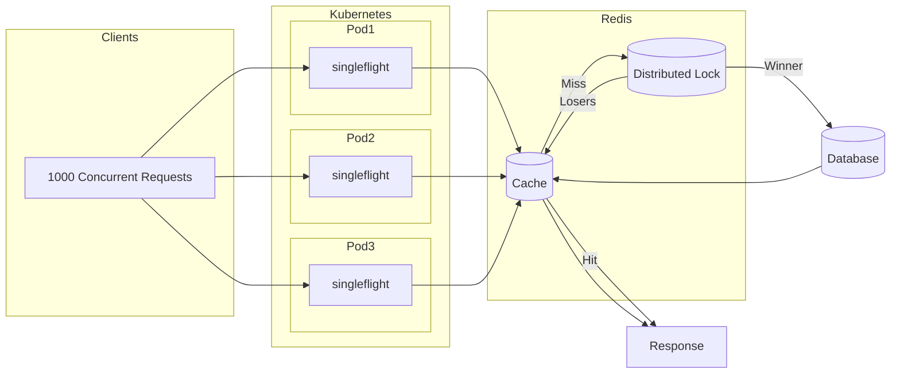

```mermaid
flowchart LR

subgraph Clients
A[1000 Concurrent Requests]
end

subgraph Kubernetes
subgraph Pod1
B1[singleflight]
end

subgraph Pod2
B2[singleflight]
end

subgraph Pod3
B3[singleflight]
end
end

subgraph Redis
C1[(Cache)]
C2[(Distributed Lock)]
end

D[(Database)]

A --> B1
A --> B2
A --> B3

B1 --> C1
B2 --> C1
B3 --> C1

C1 -->|Hit| E[Response]

C1 -->|Miss| C2

C2 -->|Winner| D
D --> C1

C2 -->|Losers| C1

C1 --> E
```
