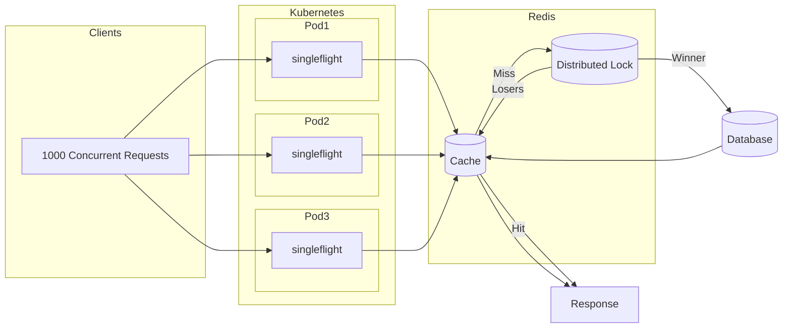
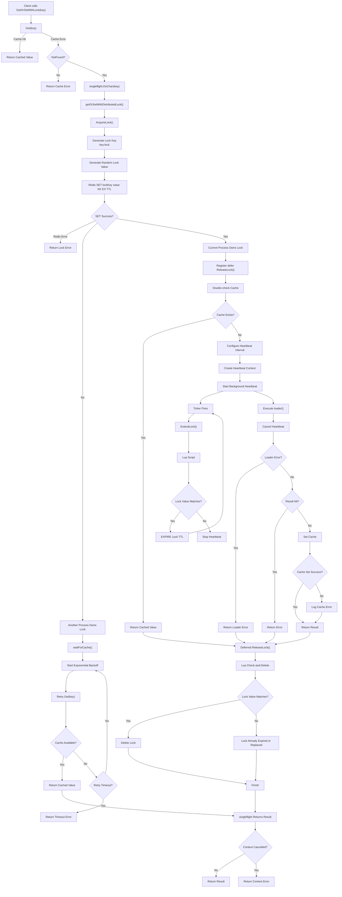
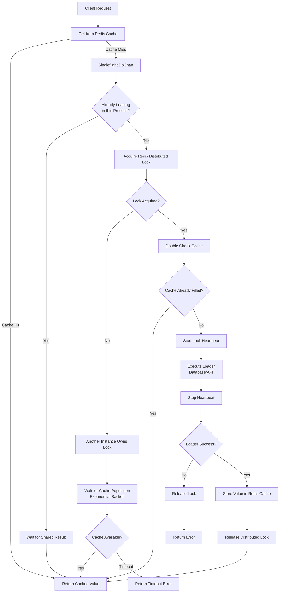

```mermaid
flowchart LR

subgraph Clients
A[1000 Concurrent Requests]
end

subgraph Kubernetes
subgraph Pod1
B1[singleflight]
end

subgraph Pod2
B2[singleflight]
end

subgraph Pod3
B3[singleflight]
end
end

subgraph Redis
C1[(Cache)]
C2[(Distributed Lock)]
end

D[(Database)]

A --> B1
A --> B2
A --> B3

B1 --> C1
B2 --> C1
B3 --> C1

C1 -->|Hit| E[Response]

C1 -->|Miss| C2

C2 -->|Winner| D
D --> C1

C2 -->|Losers| C1

C1 --> E
```

```mermaid
flowchart TD

    A["Client calls GetOrSetWithLock(key)"]

    A --> B["Get(key)"]

    B -->|Cache Hit| C["Return Cached Value"]

    B -->|Cache Error| D{"NotFound?"}

    D -->|No| E["Return Cache Error"]

    D -->|Yes| F["singleflight.DoChan(key)"]

    F --> G["getOrSetWithDistributedLock()"]

    %% ---------------------------------------------------
    %% Acquire Distributed Lock
    %% ---------------------------------------------------

    G --> H["AcquireLock()"]

    H --> I["Generate Lock Key<br/>key:lock"]

    I --> J["Generate Random Lock Value"]

    J --> K["Redis SET lockKey value NX EX TTL"]

    K --> L{"SET Success?"}

    L -->|Redis Error| M["Return Lock Error"]

    L -->|No| N["Another Process Owns Lock"]

    L -->|Yes| O["Current Process Owns Lock"]

    %% ---------------------------------------------------
    %% Wait For Cache
    %% ---------------------------------------------------

    N --> P["waitForCache()"]

    P --> Q["Start Exponential Backoff"]

    Q --> R["Retry Get(key)"]

    R --> S{"Cache Available?"}

    S -->|Yes| T["Return Cached Value"]

    S -->|No| U{"Retry Timeout?"}

    U -->|No| Q

    U -->|Yes| V["Return Timeout Error"]

    %% ---------------------------------------------------
    %% Lock Owner
    %% ---------------------------------------------------

    O --> W["Register defer ReleaseLock()"]

    W --> X["Double-check Cache"]

    X --> Y{"Cache Exists?"}

    Y -->|Yes| Z["Return Cached Value"]

    Y -->|No| AA["Configure Heartbeat Interval"]

    AA --> AB["Create Heartbeat Context"]

    AB --> AC["Start Background Heartbeat"]

    %% ---------------------------------------------------
    %% Heartbeat
    %% ---------------------------------------------------

    AC --> AD["Ticker Fires"]

    AD --> AE["ExtendLock()"]

    AE --> AF["Lua Script"]

    AF --> AG{"Lock Value Matches?"}

    AG -->|Yes| AH["EXPIRE Lock TTL"]

    AH --> AD

    AG -->|No| AI["Stop Heartbeat"]

    %% ---------------------------------------------------
    %% Loader
    %% ---------------------------------------------------

    AC --> AJ["Execute loader()"]

    AJ --> AK["Cancel Heartbeat"]

    AK --> AL{"Loader Error?"}

    AL -->|Yes| AM["Return Loader Error"]

    AL -->|No| AN{"Result Nil?"}

    AN -->|Yes| AO["Return Error"]

    AN -->|No| AP["Set Cache"]

    AP --> AQ{"Cache Set Success?"}

    AQ -->|Yes| AR["Return Result"]

    AQ -->|No| AS["Log Cache Error"]

    AS --> AR

    %% ---------------------------------------------------
    %% Release Lock
    %% ---------------------------------------------------

    Z --> AT

    AR --> AT

    AM --> AT

    AO --> AT

    AT["Deferred ReleaseLock()"]

    AT --> AU["Lua Check-and-Delete"]

    AU --> AV{"Lock Value Matches?"}

    AV -->|Yes| AW["Delete Lock"]

    AV -->|No| AX["Lock Already Expired or Replaced"]

    AW --> AY["Finish"]

    AX --> AY

    %% ---------------------------------------------------
    %% singleflight Result
    %% ---------------------------------------------------

    T --> AZ

    AY --> AZ

    AZ["singleflight Returns Result"]

    AZ --> BA{"Context Cancelled?"}

    BA -->|No| BB["Return Result"]

    BA -->|Yes| BC["Return Context Error"]
```

```mermaid
flowchart TD
    A[Client Request] --> B[Get from Redis Cache]

    B -->|Cache Hit| C[Return Cached Value]

    B -->|Cache Miss| D[Singleflight DoChan]

    D --> E{Already Loading<br/>in this Process?}

    E -->|Yes| F[Wait for Shared Result]
    F --> C

    E -->|No| G[Acquire Redis Distributed Lock]

    G --> H{Lock Acquired?}

    H -->|No| I[Another Instance Owns Lock]

    I --> J[Wait for Cache Population<br/>Exponential Backoff]

    J --> K{Cache Available?}

    K -->|Yes| C
    K -->|Timeout| L[Return Timeout Error]

    H -->|Yes| M[Double Check Cache]

    M --> N{Cache Already Filled?}

    N -->|Yes| C

    N -->|No| O[Start Lock Heartbeat]

    O --> P[Execute Loader<br/>Database/API]

    P --> Q[Stop Heartbeat]

    Q --> R{Loader Success?}

    R -->|No| S[Release Lock]
    S --> T[Return Error]

    R -->|Yes| U[Store Value in Redis Cache]

    U --> V[Release Distributed Lock]

    V --> C
```